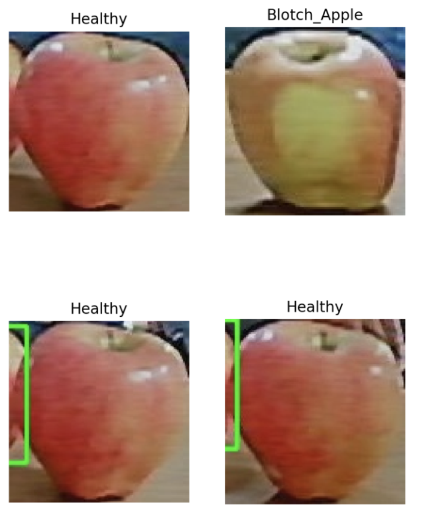
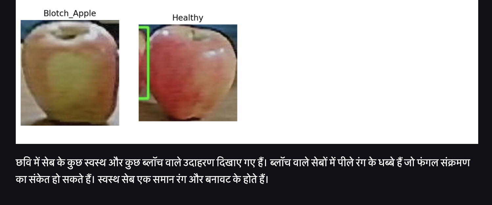
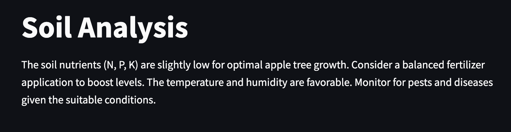
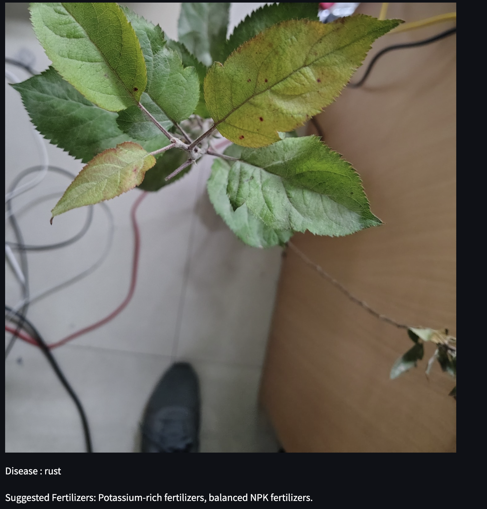

# Apple Harvest Management System

A full-stack system for apple harvest management: real-time detection with YOLO, quality prediction with TensorFlow, AI-powered insights and chatbot via Gemini, and a multilingual Streamlit dashboard with Hindi support. Integrates with Google Cloud Storage and optional MongoDB for soil data.

---

## Features

- **Apple detection** (`src/detection.py`) — YOLOv5-based detection, cropping, tracking, and upload to Google Cloud Storage
- **Quality prediction** (`src/quality_prediction.py`) — TensorFlow model for apple conditions: Normal, Blotch, Rot, Scab
- **Harvest dashboard** (`src/dashboard.py`) — Streamlit UI: sessions, quality distribution, filters, charts, and recommendations
- **Gemini integration** (`src/gemini_integration.py`) — Hindi translations, disease insights, and structured responses
- **AI chatbot** (`src/chatbot.py`) — Harvest and cultivation advice using session and quality context
- **Batch analyzer** (`src/batch_analyzer.py`) — Leaf/disease analysis with Gemini (disease, fertilizer, recommendations)
- **Soil service** (`src/soil_service.py`) — Latest soil data from MongoDB Atlas
- **Multilingual** — Dashboard and chatbot support English and Hindi

---

## Screenshots

### Harvest dashboard — apples and quality overview



### Hindi suggestions and language support



### Soil analysis view



### Leaf disease analysis (batch analyzer)



---

## Setup

1. **Install dependencies**

   ```bash
   pip install -r requirements.txt
   ```

   Or with uv:

   ```bash
   uv sync
   ```

2. **Environment**

   Copy `.env.example` to `.env` and set:

   - `GOOGLE_APPLICATION_CREDENTIALS` — path to Google Cloud service account JSON (e.g. `src/google_credentials.json`)
   - `GEMINI_API_KEY` or `GOOGLE_API_KEY` — for Gemini (chatbot, batch analyzer, translations)
   - `MONGODB_CONNECTION_STRING` — optional, for soil data

3. **Google Cloud**

   - Place your service account key at `src/google_credentials.json` (or path set in `.env`).
   - Ensure the account has access to the Storage bucket used by the app (e.g. `apple-detection-images`).

4. **Quality model (optional)**

   - Place `apple_quality_model.h5` in the project root for real quality predictions.
   - If missing, a placeholder model is used for demo.

5. **Webcam**

   - Required for live detection; ensure no other app is using the camera.

---

## Running the system

### 1. Apple detection (live)

```bash
python -c "from src import detection; detection"  # or run your detection entry point
```

Or use the script that starts webcam, runs YOLO, crops apples, and uploads to GCS.

### 2. Dashboard

```bash
streamlit run app.py
```

Then you can:

- Pick a session and see harvest summary and quality distribution
- Filter and sort by quality
- Use the AI chatbot for advice
- Switch to Hindi for UI and suggestions
- View soil data if MongoDB is configured

### 3. Batch / leaf disease analysis

Use the batch analyzer (e.g. from the dashboard or your CLI) with leaf images to get disease, fertilizer, and recommendation outputs from Gemini.

### 4. Verify imports

```bash
python verify_imports.py
```

---

## Project structure

```
├── app.py                 # Streamlit entry (runs dashboard)
├── main.py                # CLI entry
├── pyproject.toml         # Project and dependencies
├── requirements.txt      # Pip dependencies
├── .env.example           # Env template
├── verify_imports.py      # Import check
├── sources/               # Screenshots and assets
│   ├── apples.png
│   ├── hindi_suggestions.png
│   ├── soil_analysis.png
│   └── leaf_diease.png
└── src/
    ├── __init__.py
    ├── dashboard.py       # Streamlit dashboard
    ├── detection.py      # YOLO + GCS detection
    ├── quality_prediction.py
    ├── gemini_integration.py
    ├── chatbot.py        # Harvest chatbot
    ├── batch_analyzer.py  # Leaf/disease analysis
    └── soil_service.py    # MongoDB soil data
```

---

## Google Cloud Storage

- Stores cropped apple images and session JSON.
- Dashboard reads sessions and images from GCS for visualization and quality analysis.

---

## Quality model

The TensorFlow model predicts four conditions: **Normal_Apple**, **Blotch_Apple**, **Rot_Apple**, **Scab_Apple**. Without `apple_quality_model.h5`, a placeholder model is used for demonstration.

---

## Troubleshooting

- **Google Cloud errors** — Check key path, bucket name, and service account permissions.
- **Webcam not starting** — Ensure the camera is free and you have permission to access it.
- **Gemini / API errors** — Verify `GEMINI_API_KEY` or `GOOGLE_API_KEY` in `.env`.
- **MongoDB** — Soil features need `MONGODB_CONNECTION_STRING` in `.env`.

---

## License

MIT License.
